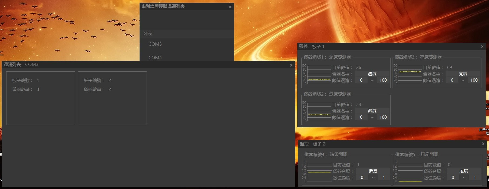

# IoT-System
物聯網系統 (農業)

## 關於硬體連接

### 通訊
> 在 [Arduino-IoT-WSN](./Arduino-IoT-WSN) 內看到 `connection.ino`皆為通訊設定
>
> 在這兩隻腳位可以連接 Esp8266 | XBee | 有線(環狀) 進行通訊連接
>
> ```c
> #define         _PIN_SOFT_RX             9
> #define         _PIN_SOFT_TX            10
> ```

### 感測及控制
> 在 [Arduino-IoT-WSN](./Arduino-IoT-WSN) 內看到 `meter.ino`皆為感測或控制設定
>
> `_PIN_DHT_01` 為第一顆 DHT22的感測腳位
>
> `_PIN_DHT_02` 為第二顆 DHT22的感測腳位
>
> `_PIN_BRITNESS` 為 亮度 的感測腳位
>
> ```c
> /*
>  *  Arduino-IoT-WSN/slave_node_dht22/meter.ino
>  */
> #define         _PIN_DHT_01               2
> #define         _PIN_DHT_02               3
> #define         _PIN_BRITNESS             A0
> ```
>

## 關於通訊

### 封包
* 標頭 `1Byte` 值為 255
* 資料訊息 `1Byte`
* * 資料型態 `1bit`
* * 板子編號 `3bits` ( 111 禁用 )
* * 是否為開關 `1bit`
* * 儀器編號 `3bits` ( 111 禁用 )
* 資料 `1Byte` ( 限制在 0~253 )
* 標尾 `1Byte` 值為 254

### CSharp & Serial
```c#
/*
 *  CSharp-IoT-Monitored-System/SerialPortAndArduino/SerialPort/Connection.cs
 */
public class Connection
{
    public bool Connect() {
        // 進行 Serial 連接
    }
    public bool DisConnect() {
        // 段開 Serial 連接
    }
    public void ReadBytes() {
        // 從 Serial 讀取資料加入 Read Buffer
    }
    public void Unpackage() {
        // 解開封包
    }
    public void AddToSend(List<byte> toSend) {
        // 將 資料加入 Send Buffer
    }
    public void Send() {
        // 將 Send Buffer 資料傳送至 Serial
    }
}
```

### Serial & WSN
WSN 主要利用 [板子master](./Arduino-IoT-WSN/master/connection.ino) 做訊息交換
```c
/*
 *  Arduino-IoT-WSN/master/connection.ino
 */
void ConnectionInit(){
    // baudrate & memset & pinMode 通訊基本設定 ...
}
void ReadByteFromBroad(){
    // 從 slave 讀取 byte 進 buffer ...
}
void ReadByteFromPC(){
    // 從 Serial 讀取 byte 進 buffer ...
}
void SendToBroad(){
    // 將 封包送至 slave ...
}
void SendToPC(){
    // 將 封包送至 Serial ...
}

/*
 *  master/master.ino
 */
void loop() {
    // 程式循環執行
    ReadByteFromBroad();
    SendToPC();
    ReadByteFromPC();
    SendToBroad();
}
```


## 展示

